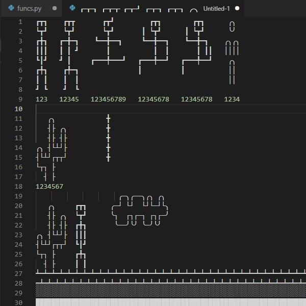

# PT_ConsoleApp_GameJumpty

## General Information

Jumpy is a stick figure fighting for its life by jumping over a cactus, a stone block and a snake.

The game would probably remind you of Chrome's dinosaur jumping game in case of no Internet.

It was created in order to test the execution of a few parallel tasks. The expected result was for the game to constantly receive user keyboard input (\[<\], \[>\], \[^\]) and in the same time to visualize the 'moving' landscape without any interruptions.

## Technologies

using System.Threading.Tasks;

## Instructions

Use the left \[<\] and right \[>\] arrow keys to move around and the up \[^\] arrow key to jump!

If you happily jump over a dozen \[12\] of cactuses, blocks and snakes you would WIN.
Else - LOSE.

## Contents

The solution contains 2 directories:

- src
  - GameJumpty.Game
  - GameJumpty.sln
- res
  - scrot
    - PT_ConsoleApp_GameShipsAndBoats.jpg

## Drawings

Jumpy himself and the Obstacles for him to jump over are all drawn using Unicode characters. Here is a screenshot of the WIP:

\~THE END\~
