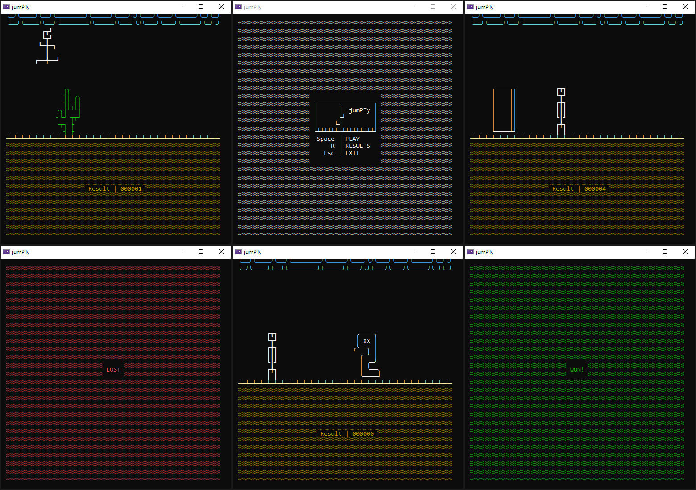

# PT_ConsoleApp_GameJumpty

## General Information

**Jumpy** is a stick figure fighting for his life by jumping over *cacti*, *stone blocks*, *snakes* and *Darth Vaders*.

The game would probably remind you of Chrome's dinosaur jumping game in case of no Internet.

It was created in order to test the execution of a few parallel tasks. The game constantly receives user input from keyboard (\[<\], \[>\], \[^\]) and visualizes the 'moving' landscape in parallel, without any interruptions.

---

## Technologies

- using System.Threading.Tasks;
- using Newtonsoft.Json;

---

## Instructions

Use the left \[<\] and right \[>\] arrow keys to move around and the up \[^\] arrow key to jump!  
If you happily jump over a dozen \[12\] of cacti, blocks and snakes you WIN.  
Else, you LOSE.

---

## Contents

The solution contains 2 directories:

- src
  - GameJumpty.Game (console app)
  - GameJumpty.sln
- res
  - images
    - jumpty_all.jpg (cover)

---

## Drawings

The Obstacles (the archenemies for Jumpty to jump over) are drawn by using Unicode characters.

Here are different versions and states of Jumpty himself:

